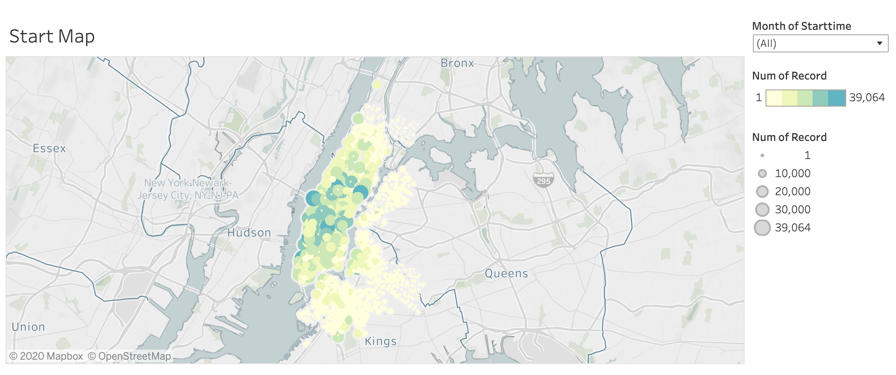
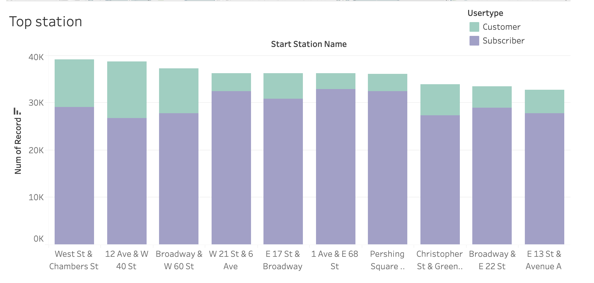
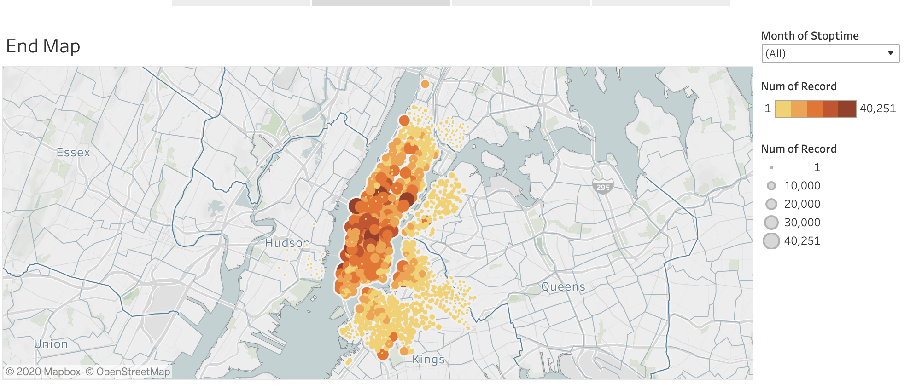
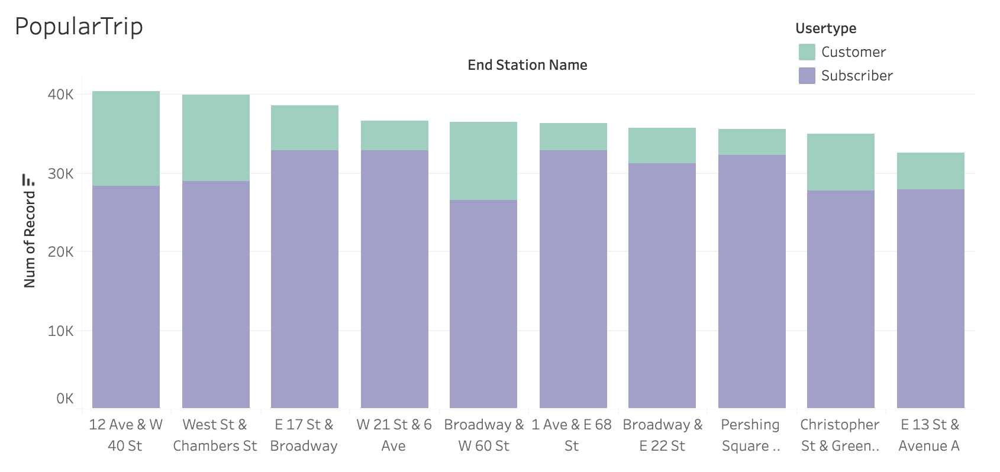
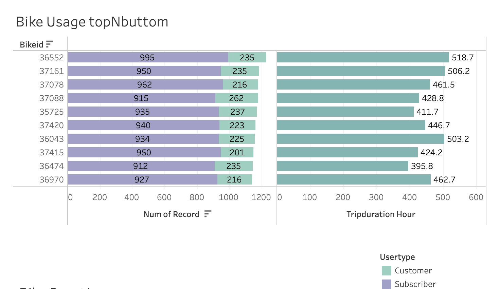
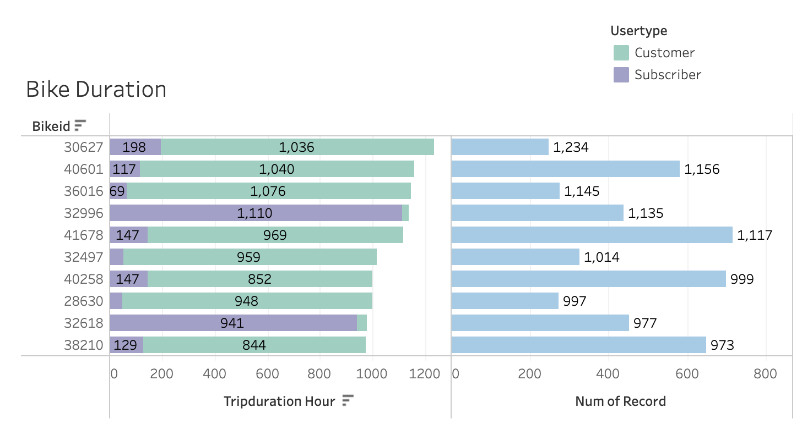

# Citi Bike Analytics

## Task

#### Visualize and discovered phenomena through [Citi Bike Data](https://www.citibikenyc.com/system-data) using Tableau. Datasets included bike data from January to June 2020.

## Top starting station

## Popular trip destination

## View top 10 usage and duration by bike ID

***Obeservations***

* With the study of Bike ID to identify the king of bike who in both the top 10 of usage and trip duration, but  there is no overlap so no winner for this contest. Hence, the bike that used the most are subscribers and the total duration of the trip is short. On the other hand, the bike that runs more is used by less people; this means people take longer trip with these bikes and they are not subscribers.
