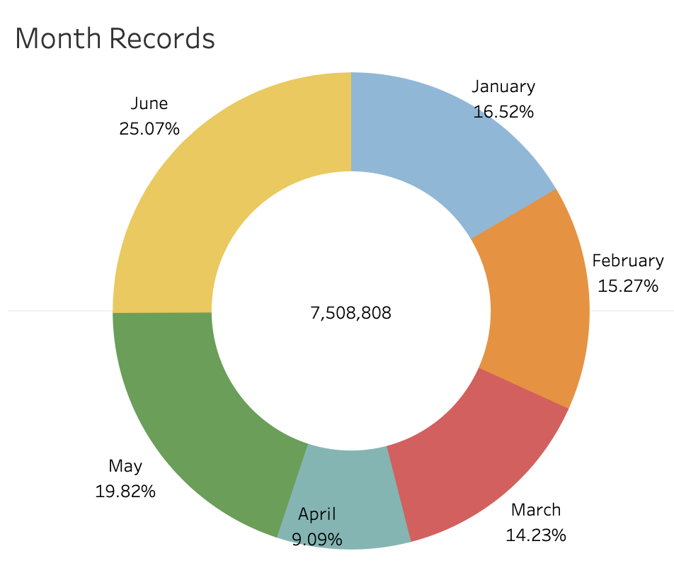
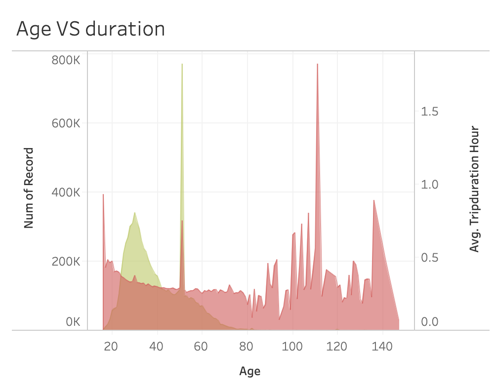
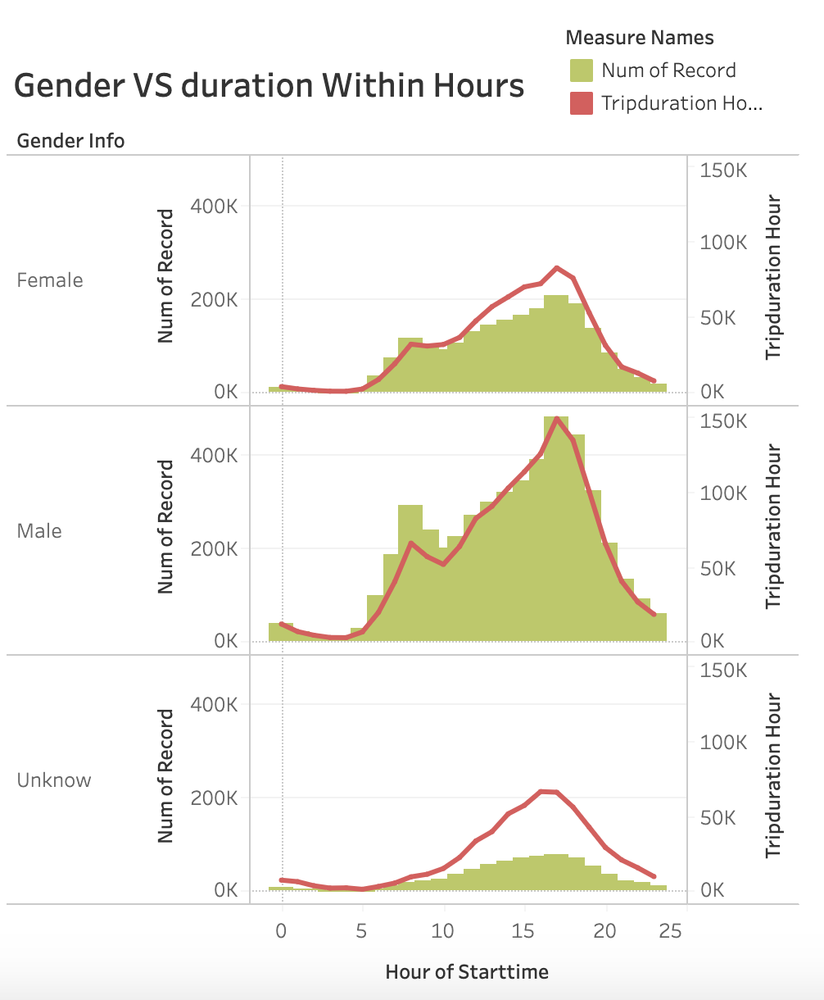

# Citi Bike Analytics

## Task

#### Visualize and discovered phenomena through [Citi Bike Data](https://www.citibikenyc.com/system-data) using Tableau. Datasets included bike data from January to June 2020.

## Top starting station

## Popular trip destination

## View top 10 usage and duration by bike ID

***Obeservations***

* With the study of Bike ID to identify the king of bike who in both the top 10 of usage and trip duration, but  there is no overlap so no winner for this contest. Hence, the bike that used the most are subscribers and the total duration of the trip is short. On the other hand, the bike that runs more is used by less people; this means people take longer trip with these bikes and they are not subscribers.

## View trip duration with multiple elements

***Obeservations***

* April 2020 has the least number of bike usage records, since people are quarantine at home. From the age and trip duration chart, we can see people are not honest with their age, since the user for top average trip duration is someone who is in age 111. But we can also see that age 51 used bike more that others. Lastly, there is relationship between the usage and trip duration and people are more likely to use the bike at 5 pm everyday.
